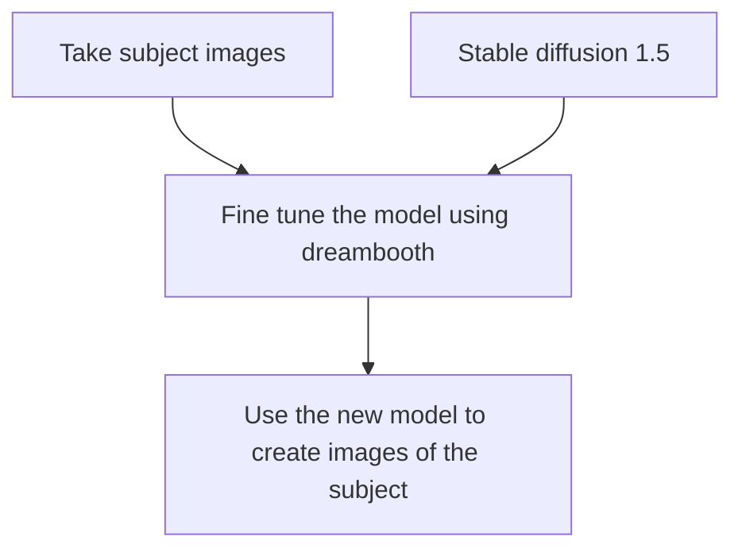

# dreambooth-exeriment

This is a simple experiment to MLOpsify the dreambooth project.

## Sources

https://huggingface.co/docs/diffusers/training/dreambooth
https://github.com/huggingface/diffusers/tree/main/examples/dreambooth
https://blog.paperspace.com/dreambooth-stable-diffusion-tutorial-1/

## Experiment

This experiment is based on the dreambooth project. The goal is to train a model to generate images of a given subject. The model is trained on a dataset of images of the subject and a dataset of images of people in general. The model is then used to generate images of the subject.

<div class="center">
<h3><center> Experiment diagram</center> </h3>


</div>

## MLOps

The experiment is MLOpsified using DVC and CML.


## Run the code

You can get a look at the gitlab-ci.yml file to see the pipeline execution steps.

You will need the full content of this repository to run the experiment

Clone the repo

```bash
git clone https://gitlab.com/AdrienAllemand/dreambooth-api.git
```

Then go into the `scripts` folder and run the `installation.sh` script

Wait for the installation to complete for the next step you will need the environment variable `SUBJECT_NAME`to be set to the name of your training subject. 

Then run the `train.sh` script and wait for the training to complete.

Lastly run the `inference.sh` script to generate images of your subject. Feel free to edit the `inference.sh` script to change the prompts. It works in a way where you have an array of subjects and an array of styles. They are simply concatenated to make the resulting prompts. 2 subjects and 2 styles will generate 4 images.

The pipeline runs one last script the `report.sh` script that will generate a comment on the commit containing the generated images.


```bash
## Scriptless steps

### Create the k8s pod

I created a pod on the k8s cluster based on the following yaml file:

```yaml
apiVersion: v1
kind: Pod
metadata:
  name: gpu-pod
spec:
  containers:
  - name: gpu-container
    image: nvidia/cuda:12.0.1-runtime-ubuntu22.04
    resources:
      limits:
        nvidia.com/gpu: 1
    command: ["/bin/bash"]
    args: ["-c", "while true; do echo 'Running GPU pod...'; sleep 30; done"]
  restartPolicy: Never
  ```

The next steps are run on the pod. To log onto the pod use :
This assumes you have configured your kubectl to target the right cluster and it has access to GPUs.

```bash
kubectl exec -it gpu-pod --namespace=dreambooth-experience -- /bin/bash
```

### Clone the repo & update

You will need the content of this repository to run the experiment. 

I used the personal access token in `./secrets` folder to clone the repo you should make your own and have the possibility to save it there if you want, the folder should be gitignored.

You can clone it using the following command.

```bash
apt update
apt install -y git
git clone https://gitlab.com/AdrienAllemand/dreambooth-api.git
````

We will need GIT and Python3 and pip3 to run the training
```bash
apt install -y python3-pip
apt install -y python3.10-venv
pip3 install --upgrade pip
````

Next steps are inspired from the hugginface tutorial :
https://github.com/huggingface/diffusers/tree/main/examples/dreambooth
that is a better version of :
https://huggingface.co/docs/diffusers/training/dreambooth

### Create a virtual environment

First you need to create a virtual environment for the experiment.

```bash
# Create the virtual environment
python3 -m venv .venv
# Activate the virtual environment
source .venv/bin/activate
```

### Install the diffusers library

Then clone the diffusers repository to have the training scripts 

```bash
git clone https://github.com/huggingface/diffusers
```
### Requirements

Then install the requirements. I'm not sure about the necessity of installing all requirements.txt files so i did it just in case.

```bash
pip install --requirement ../requirements.txt
cd diffusers
pip install -e .
cd examples/dreambooth
pip install -r requirements.txt
cd ../../../
pip install -U -r ./diffusers/examples/dreambooth/requirements.txt
```
### Training

```bash
if [ -z "$SUBJECT_NAME" ]; then
  echo "SUBJECT_NAME is empty"
else

#echo "Listing the installed packages in pip :"
#python3 -m pip list

#export MODEL_NAME="stabilityai/stable-diffusion-2"
export MODEL_NAME="runwayml/stable-diffusion-v1-5"
export INSTANCE_DIR="../data/$SUBJECT_NAME"
mkdir -p $INSTANCE_DIR
export OUTPUT_DIR="../model/$SUBJECT_NAME"
mkdir -p $OUTPUT_DIR
export CLASS_DIR="../class"
echo "Launching training for $SUBJECT_NAME using $MODEL_NAME"

accelerate launch --num_processes=1 --gpu_ids=0 ./diffusers/examples/dreambooth/train_dreambooth.py \
  --pretrained_model_name_or_path=$MODEL_NAME  \
  --instance_data_dir=$INSTANCE_DIR \
  --class_data_dir=$CLASS_DIR \
  --output_dir=$OUTPUT_DIR \
  --with_prior_preservation --prior_loss_weight=1.0 \
  --instance_prompt="a photo of $SUBJECT_NAME person" \
  --class_prompt="a photo of a person" \
  --resolution=512 \
  --train_batch_size=1 \
  --gradient_accumulation_steps=1 \
  --learning_rate=5e-6 \
  --lr_scheduler="constant" \
  --lr_warmup_steps=0 \
  --num_class_images=100 \
  --max_train_steps=600 \
  --train_text_encoder \
  --checkpointing_steps=200 \
  --num_train_epochs=1 
fi
```

After 15~ minutes the model training is done we can do some inference. The following example uses the most basic inference code to generate a single image. If you want a more complexe version that generated multiple images at the same time on each checkpoint you can use the `inference.sh` script.

```python
from diffusers import StableDiffusionPipeline
import torch

subjectName = os.environ.get('SUBJECT_NAME')
# path to your trained model assuming you are in scripts folder
model_id = '../model/' + subjectName
pipe = StableDiffusionPipeline.from_pretrained(model_id, torch_dtype=torch.float16).to("cuda")

prompt = 'A painting of ' + subjectName + ' person in the style of Vincent Van Gogh'
image = pipe(prompt, num_inference_steps=50, guidance_scale=7.5).images[0]

image.save('tony-van-gogh.png')
```

to pull the image locally use

### prompt tests

This prompt worked very well:
> prompt = "A portrait of tony, beautiful, vivid colors, no default, symmetrical, centered, ornate, details, smooth, sharp focus, illustration, realistic, cinematic, artstation, award winning, unreal engine, octane render, cinematic light, depth of field, Blender and Photoshop, dynamic dramatic cinematic lighting, very inspirational"

> prompt = "A portrait of tony as a medieval knight, beautiful face, vivid colors, no default, symmetrical, centered, ornate, details, smooth, sharp focus, illustration, realistic, cinematic, artstation, award winning, unreal engine, octane render, cinematic light, depth of field, Blender and Photoshop, dynamic dramatic cinematic lighting, very inspirational"

## K8s gitlab runner setup

We want our gitlab pipeline to execute within the kubernetes cluster. To do so we need to install a gitlab runner on the cluster.

>See https://docs.gitlab.com/runner/install/kubernetes.html

>https://www.youtube.com/watch?v=0Fes86qtBSc

Using helm we install the runner on the cluster
```bash
helm repo add gitlab https://charts.gitlab.io
helm repo update
```

We need to create a configuration file for the runner :
This needs to be downloaded on the machine we use to administrate the K8s cluster.
```bash
wget https://gitlab.com/gitlab-org/charts/gitlab-runner/-/tree/main/values.yaml
```

Specify the gitlab instance url in the `values.yaml` configuration file. Here we use a http://gitlab.com but you could run your own gitlab and put it's url.
```yaml
# values.yaml
gitlabUrl: https://gitlab.com/
```
> if you get a 401 error when trying to register the runner, check that the url is correct and is using https.
> 
We also need to add  the runnerRegistrationToken. You can get it directly from your gitlab UI > Repository > Settings > CI/CD > Runners > Expand the runner > Copy the token. 

The mentioned video stores it directly in the `values.yaml` file, it's not a good practice to store secrets in the configuration file. We will use a kubernetes secret to store the token then update the `runners.secret` value in `values.yaml` with the name of the secret.

> See https://docs.gitlab.com/runner/install/kubernetes.html#store-registration-tokens-or-runner-tokens-in-secrets

To encode the token, use the following command :
```bash
echo -n 'my-token' | base64
````

Then paste the output un the secret definition file 'gitlab-runner-secret.yaml'. You can find a template for this file in the `./k8s` folder of this repository. __Do not save the secret file in the repository__.

Once the secret is created add the secret name to your `values.yaml` file.
```yaml
#[...]
runners:
  secret: gitlab-runner-secret
#[...]
```

Next step is to create a RBAC configuration to give permission to create pods to the cluster.
```yaml
#[...]
rbac:
  create: true # create a service account and a role binding
  rules:  # these are the default roles uncommented
    - resources: ["configmaps", "pods", "pods/attach", "secrets", "services"]
      verbs: ["get", "list", "watch", "create", "patch", "update", "delete"]
    - apiGroups: [""]
      resources: ["pods/exec"]
      verbs: ["create", "patch", "delete"]
#[...]
```

# Kubernetes runner configuration

## Assign GPU to the pipeline pods
One problem we would encounter running the pipeline "as is" is that pods are deployed on gpuless nodes by the runner. We can fix this by adding a nodeSelector to the pipeline pods.

```yaml
runners:
  config: |
    [[runners]]
      [runners.kubernetes]
        namespace = "{{.Release.Namespace}}"
        image = "ubuntu:16.04"
      [runners.kubernetes.node_selector]
        "nvidia.com/gpu.present" = "true"
```
  
Finally we can install the runner on the cluster
```bash
helm upgrade --install --namespace dreambooth-experience gitlab-runner -f ./values.yaml gitlab/gitlab-runner
```
If you need to update an existing runner use 
```bash
helm upgrade --install --namespace dreambooth-experience gitlab-runner -f ./values.yaml gitlab/gitlab-runner

You should now see your runner in the gitlab UI > Repository > Settings > CI/CD > Runners, correctly registered as a Project Runner.

### Multi-GPU checkpoint inference

There is a problem with accelerate when generating checkpoints in a multi-GPU architecture. There are 2 solutions : run without checkpointing or run with a single GPU.

To run with a single GPU, we need to modify the following line to the `train.sh` script :
```bash 
accelerate launch --num_processes=1 --gpu_ids=0 ./diffusers/examples/dreambooth/train_dreambooth.py \
...
```  
Otherwise, the output of the checkpoint will be lacking the unet/ folder and it will be impossible to make images from that checkpoint.

### state observation

To better understand  what is  where in the pod here are a few results of LS commands

This is the root folder of the cloned repository.
```bash
root@gpu-pod:/dreambooth-api# ls
README.md  class  config.toml  data  docker  k8s  model  requirements.txt  scripts
```
Most things are executed from the scripts folder. Note the `diffusers` folder that has been cloned by the `installation.sh` script.
```bash
root@gpu-pod:/dreambooth-api/scripts# ls
INSTANCE_DIR  OUTPUT_DIR  diffusers  infere.py  installation.sh  report.sh  train.sh  train_dreambooth.py
```

Inside the `model/tony/` folder we can see the model files and the checkpoints.
```bash
root@gpu-pod:/dreambooth-api/model/tony# ls
checkpoint-40  checkpoint-80  feature_extractor  logs  model_index.json  safety_checker  scheduler  text_encoder  tokenizer  unet  vae
```

The content of a checkpoint folder is as follows:
```bash
root@gpu-pod:/dreambooth-api/model/tony/checkpoint-40# ls -la
total 7677192
-rw-r--r--  1 root root 7861401379 Feb 27 10:10 optimizer.bin
-rw-r--r--  1 root root      14727 Feb 27 10:10 random_states_0.pkl
-rw-r--r--  1 root root        563 Feb 27 10:10 scheduler.bin
drwxr-xr-x  2 root root       4096 Feb 27 10:10 text_encoder
drwxr-xr-x  2 root root       4096 Feb 27 10:10 unet
```

### Copy image from pod to local
```bash
kubectl cp dreambooth-experience/gpu-pod:/dreambooth-api/images/ ./images/ 
```

### Temps de run
- 2 minutes installation de l'environment
- 1 mintute téléchargement du model


## Using DVC to reproduce the experiment

### install cloud sdk

```bash
# This is for hte linux x86_64 architecture see https://cloud.google.com/sdk/docs/install-sdk#linux for other architectures
curl -O https://dl.google.com/dl/cloudsdk/channels/rapid/downloads/google-cloud-cli-421.0.0-linux-x86_64.tar.gz
# Extract the SDK
tar -xf google-cloud-cli-421.0.0-linux-x86_64.tar.gz

# install the sdk. it will prompt you to setup the PATH variable so the next command can be run
./google-cloud-sdk/install.sh

# Initialize and login to Google Cloud
gcloud init

# List all available projects
gcloud projects list

# Select your Google Cloud project
gcloud config set project <id of your gcp project>

# Set authentication for our ML experiment
# https://dvc.org/doc/command-reference/remote/add#google-cloud-storage
# https://cloud.google.com/sdk/gcloud/reference/auth/application-default/login
gcloud auth application-default login
```

### Create a bucket and add it to DVC

```bash
# Create a bucket for the experiment
gcloud storage buckets create gs://dreambooth-experience-bucket \
  --location=EUROPE-WEST6 \
  --uniform-bucket-level-access \
  --public-access-prevention

# Initialize DVC in the working directory
dvc init

# Add the Google Storage remote bucket
dvc remote add -d data gs://<my bucket name>/dvcstore
```

### Add preparation stage

This stage will take images in the `data/images` folder and prepare them for training. It will crop them to the size specified in the `prepare.size` parameter (in pixel). The output of this stage will be in the `data/prepared` folder.

- Stage name : 
  - prepare
- Parameters : 
  - prepare.size
- Dependencies : 
  - scripts/prepare.py
  - data/images
- Outputs : 
  - data/prepared
- CMD to run : 
  - python3 scripts/prepare.py

```bash 
# Add the prepare stage to the dvc pipeline
dvc stage add -n prepare \
  -p prepare.size \
  -d scripts/prepare.py \
  -d data/images \
  -o data/prepared \
  python3 scripts/prepare.py
```

### Add train stage

This stage will take the prepared images and train the model. The output of this stage will be in the `model/` folder.

```bash
# Add the train stage to the dvc pipeline
dvc stage add -n train \
  -p train.model_name \
  -p train.instance_prompt \
  -p train.class_prompt \
  -p train.image_size \
  -p train.learning_rate \
  -p train.steps \
  -d scripts/train.py \
  -d data/prepared \
  -o model \
  sh scripts/train.py
```

# config s3 for minio (local) for dvc
add to file `.dvc/config` to have it run locally.
```
[core]
    remote = myremote
['remote "myremote"']
    url = s3://dreambooth-bucket
    endpointurl = https://minio-aii.iict.ch
    access_key_id = minio
```

To avoid having the password stored locally we will use the `dvc remote modify` command to set the password.
You can use the following command to set the password in the terminal without it being stored in the history.
```bash
read -sp 'S3 Access key : ' SECRET_ACCESS_KEY
dvc remote modify myremote secret_access_key $SECRET_ACCESS_KEY
```