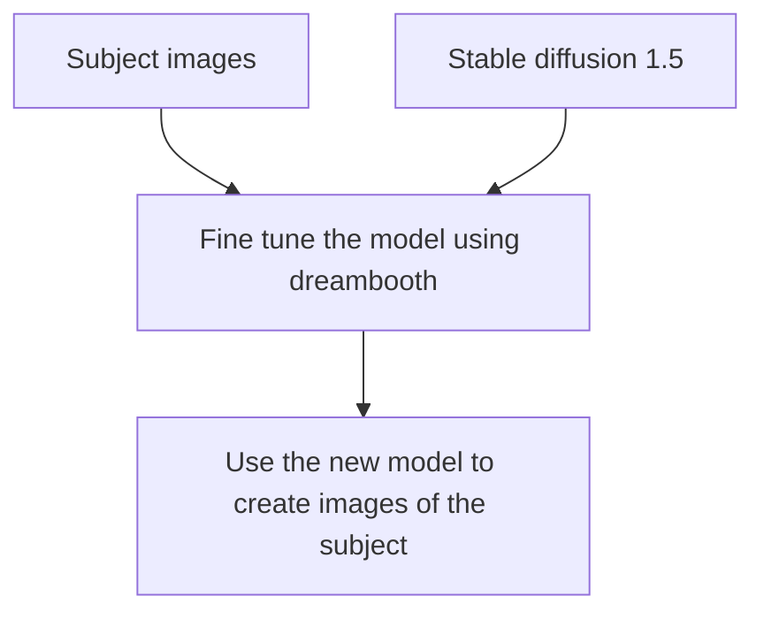
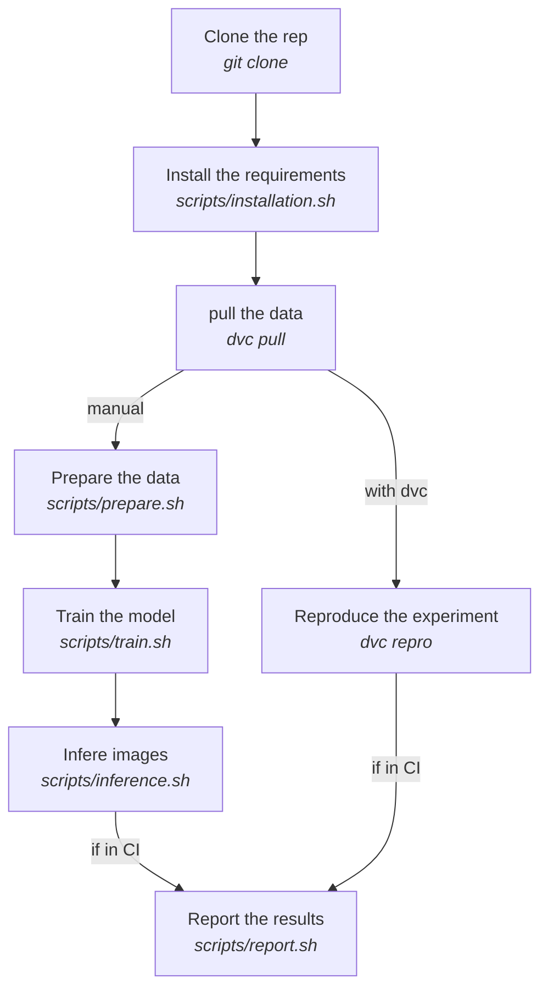

# DreamBooth Experiment

This is a simple experiment to MLOpsify the DreamBooth project using DVC and CML.

- [DreamBooth Experiment](#dreambooth-experiment)
  - [The Experiment](#the-experiment)
  - [Run the Experiment on the Cluster Manually](#run-the-experiment-on-the-cluster-manually)
    - [Connect to the Environment](#connect-to-the-environment)
      - [Create the K8s Pod](#create-the-k8s-pod)
      - [Log onto the Pod](#log-onto-the-pod)
    - [Clone the Experiment Repository](#clone-the-experiment-repository)
    - [Installation](#installation)
      - [Clone the Diffusers Repo](#clone-the-diffusers-repo)
      - [Install Python Requirements](#install-python-requirements)
      - [Install JQ and YQ](#install-jq-and-yq)
    - [Pull the Data with DVC](#pull-the-data-with-dvc)
    - [Run the Experiment](#run-the-experiment)
    - [Push the Results](#push-the-results)
  - [Integrate with GitLab](#integrate-with-gitlab)
    - [K8s GitLab Runner Setup](#k8s-gitlab-runner-setup)
    - [Kubernetes Runner Configuration](#kubernetes-runner-configuration)
      - [Assign GPU to the Pipeline Pods](#assign-gpu-to-the-pipeline-pods)
      - [Multi-GPU Checkpoint Inference](#multi-gpu-checkpoint-inference)
      - [Create the DVC Pipeline](#create-the-dvc-pipeline)
        - [Add Preparation Stage](#add-preparation-stage)
        - [Add Train Stage](#add-train-stage)
        - [Add Inference Stage](#add-inference-stage)
  - [Resources](#resources)

## The Experiment

This experiment is based on the DreamBooth project.

The goal is to train a model to generate images of a given subject. The model is trained on a dataset of images of the subject and a dataset of images of people in general. The model is then used to generate images of the subject.

<div class="center">
<h3><center> Experiment diagram</center> </h3>
<center>



</center> 
</div>

## Run the Experiment on the Cluster Manually

As this experiment requires a lot of VRAM we recommend you run it on a GPU enabled machine with more than 24Go of VRAM. We used 2x Nvidia A40 GPUs with 48 Go of VRAM but you can probably get away with less if you edit the training script to use less VRAM. (see https://github.com/huggingface/diffusers/tree/main/examples/dreambooth for more details on possible configurations of the training script)

> You can get a look at the `gitlab-ci.yml` file to see the pipeline execution steps.

> You will need the full content of this repository to run the experiment

<div class="center">
<h3>
  <center> 
    Full run of the experiment
  </center> 
</h3>
<center>



  </center> 
</div>

### Connect to the Environment

Depending on your context, you will need to connect to the environment you will use to run this experiment.

If you want to run the experiment on a Kubernetes pod in your cluster you can do the following :

#### Create the K8s Pod

> You will need to have a Kubernetes cluster with GPUs available to run this experiment.

> You will need to have `kubectl` configured to target the right cluster or use the web interface rancher to create the pod : https://rancher.iict.ch

> For our experiment we run the pod in a namespace called `dreambooth-experience`.

You can either use the command line version or go through [rancher](https://rancher.iict.ch/dashboard/) web interface to create the pod. Our rancher is only available when connect to the VPN, being connected to the Wifi of the school is not enough.

I created a pod on the k8s cluster based on the following yaml file:

```yaml
apiVersion: v1
kind: Pod
metadata:
  name: gpu-pod
spec:
  containers:
    - name: gpu-container
      image: nvidia/cuda:12.0.1-runtime-ubuntu22.04
      resources:
        limits:
          nvidia.com/gpu: 1
      command: ["/bin/bash"]
      args: ["-c", "while true; do echo 'Running GPU pod...'; sleep 30; done"]
  restartPolicy: Never
```

Note that we use the container image `nvidia/cuda:12.0.1-runtime-ubuntu22.04` to have a pre-configured environment with CUDA.

#### Log onto the Pod

> This assumes you have configured your `kubectl` to target the right cluster pod and it has access to GPUs.

> Our pod is named `gpu-pod` and is in the `dreambooth-experience` namespace.

```bash
kubectl exec -it gpu-pod --namespace=dreambooth-experience -- /bin/bash
```

Congratulation, you now have a shell on a GPU enabled machine in our K8s cluster. If you want to be sure you have access to the GPU from the pod you created you can run the following command :

```bash
nvidia-smi
```

You should see something like this :

```bash
root@gpu-pod:/# nvidia-smi
Wed Mar 22 07:48:09 2023
+-----------------------------------------------------------------------------+
| NVIDIA-SMI 525.60.13    Driver Version: 525.60.13    CUDA Version: 12.0     |
|-------------------------------+----------------------+----------------------+
| GPU  Name        Persistence-M| Bus-Id        Disp.A | Volatile Uncorr. ECC |
| Fan  Temp  Perf  Pwr:Usage/Cap|         Memory-Usage | GPU-Util  Compute M. |
|                               |                      |               MIG M. |
|===============================+======================+======================|
|   0  NVIDIA A40          On   | 00000000:CA:00.0 Off |                    0 |
|  0%   32C    P8    29W / 300W |      0MiB / 46068MiB |      0%      Default |
|                               |                      |                  N/A |
+-------------------------------+----------------------+----------------------+

+-----------------------------------------------------------------------------+
| Processes:                                                                  |
|  GPU   GI   CI        PID   Type   Process name                  GPU Memory |
|        ID   ID                                                   Usage      |
|=============================================================================|
|  No running processes found                                                 |
+-----------------------------------------------------------------------------+
```

### Clone the Experiment Repository

> You need to have Git installed: `apt install -y git`

> You need to have a personal access token to clone the repo. You should make your own and have the possibility to save it in a file in the `./secrets` folder if you want for further use, the folder should be ignored by Git at all time.

```bash
git clone https://gitlab.com/AdrienAllemand/dreambooth-api.git
```

Most of the following steps are run from the root of the repo.

### Installation

The `installation.sh` script will install all the requirements to run the experiment in a Debian based environment such as the k8s pod we created earlier.

> **Note:** This will not create a virtual environment, it will install the requirements globally on .

If you want to install the requirements manually, you can do the following :

#### Clone the Diffusers Repo

> **Note:** You need to have Git installed

```bash
git clone https://github.com/huggingface/diffusers
```

The diffusers are used to train the model. We will use the DreamBooth example to fine tune the model.

#### Install Python Requirements

> You need to have python3 in version 3.10 and pip3 installed

```bash
# Create the virtual environment
python3 -m venv .venv
# Activate the virtual environment
. .venv/bin/activate
# Install our requirements
pip3 install --upgrade pip
pip3 install -r requirements.txt
# Install the diffusers requirements
pip install -e ./diffusers
pip install -r ./diffusers/examples/dreambooth/requirements.txt
```

#### Install JQ and YQ

To give access to the parameters in `params.yaml` to our `sh` scripts, we use `yq` over `jq`. This is used to centralize changes to the parameters in one file without needing to modify the experiment code.

```bash
apt install -y jq
jq --version
pip install yq
yq --version
```

Parameters can be found in `params.yaml` in the root of the repo.

### Pull the Data with DVC

When you installed the dependencies from our `requirement.txt` file you should have installed DVC. DVC is used to manage the data used in the experiment.

DVC uses S3 to store the data. For each data tracked and stored by DVC on S3, a metadata file is created in the `.dvc` folder. This metadata file contains the hash of the data and the path to the data on S3. The metadata file is used to check if the data has changed and if it needs to be updated.

> **Note:** Git is in charge of tracking the metadata files so you should commit the metadata files but not the data itself.

We first initialize DVC in the repo :

```bash
dvc init
```

> **Note:** If DVC was already initialized, you can use `dvc init -f` to force reinitialize it.

This will create a `.dvc` folder in the root of the repo.

We will use an S3 self-hosted by a MinIO service. To configure DVC, we need to create a `~/.dvc/config` file.

You can create the file with the following command :

```bash
dvc remote add myremote s3://dreambooth-bucket && \
    dvc remote modify myremote endpointurl https://minio-aii.iict.ch
```

Next, you can add the MinIO credentials to the DVC config with the following command :

```bash
echo -n 'MinIO S3 Secret Access Key : ' && \
    read -s MINIO_SECRET_ACCESS_KEY && \
    dvc remote modify --local myremote access_key_id minio && \
    dvc remote modify --local myremote secret_access_key $MINIO_SECRET_ACCESS_KEY && \
    unset MINIO_SECRET_ACCESS_KEY && \
    echo -e '\nAdded MinIO credentials to DVC config'
```

> **!!! WARNING !!!**
>
> You should not store secrets in the `~/.dvc/config` file. You should use the `--local` flag to store the secret in the local config file. This file is ignored by Git. See the [DVC config documentation](https://dvc.org/doc/command-reference/config#description) for more information.

To pull the data, we use the following command :

```bash
dvc pull
```

Depending on the state of the experiment on the S3 bucket, this command can take a while to complete.

### Run the Experiment

You now have the latest "state" of the experiment both for the code and the data. You can now run the experiment.

You can run the experiment using DVC. It is an abstraction of the three stages `prepre`, `train` and `infere`. Or you can run the stages individually. Depending on the state of the data you pulled from the S3 bucket, DVC might skip some stages. If you want to force the execution of a stage you can use the `--force` flag or to force the execution of all stages you can use the `--force-all` flag.

To run all at once with DVC you can do :

```bash
dvc repro
dvc repro --force-all
```

### Push the Results

Once the experiment is done, you can push the results to the S3 bucket using the following command :

```bash
dvc push
git add -A
git commit -m "Experiment results"
git push
```

## Integrate with GitLab

### K8s GitLab Runner Setup

We want our GitLab pipeline to execute within the Kubernetes cluster. To do so we need to install a GitLab runner on the cluster.

> See https://docs.gitlab.com/runner/install/kubernetes.html

> https://www.youtube.com/watch?v=0Fes86qtBSc

Using helm we install the runner on the cluster

```bash
helm repo add gitlab https://charts.gitlab.io
helm repo update
```

We need to create a configuration file for the runner :
This needs to be downloaded on the machine we use to administrate the K8s cluster.

```bash
wget https://gitlab.com/gitlab-org/charts/gitlab-runner/-/tree/main/values.yaml
```

Specify the GitLab instance url in the `values.yaml` configuration file. Here we use a http://gitlab.com but you could run your own GitLab and put it's url.

```yaml
# values.yaml
gitlabUrl: https://gitlab.com/
```

> if you get a 401 error when trying to register the runner, check that the url is correct and is using https.
>
> We also need to add the runnerRegistrationToken. You can get it directly from your gitlab UI > Repository > Settings > CI/CD > Runners > Expand the runner > Copy the token.

The mentioned video stores it directly in the `values.yaml` file, it's not a good practice to store secrets in the configuration file. We will use a Kubernetes secret to store the token then update the `runners.secret` value in `values.yaml` with the name of the secret.

> See https://docs.gitlab.com/runner/install/kubernetes.html#store-registration-tokens-or-runner-tokens-in-secrets

To encode the token, use the following command :

```bash
echo -n 'my-token' | base64
```

Then paste the output un the secret definition file 'gitlab-runner-secret.yaml'. You can find a template for this file in the `./k8s` folder of this repository. **Do not save the secret file in the repository**.

Once the secret is created add the secret name to your `values.yaml` file.

```yaml
#[...]
runners:
  secret: gitlab-runner-secret
#[...]
```

Next step is to create a RBAC configuration to give permission to create pods to the cluster.

```yaml
#[...]
rbac:
  create: true # create a service account and a role binding
  rules: # these are the default roles uncommented
    - resources: ["configmaps", "pods", "pods/attach", "secrets", "services"]
      verbs: ["get", "list", "watch", "create", "patch", "update", "delete"]
    - apiGroups: [""]
      resources: ["pods/exec"]
      verbs: ["create", "patch", "delete"]
#[...]
```

### Kubernetes Runner Configuration

#### Assign GPU to the Pipeline Pods

One problem we would encounter running the pipeline "as is" is that pods are deployed on GPU-less nodes by the runner. We can fix this by adding a nodeSelector to the pipeline pods.

```yaml
runners:
  config: |
    [[runners]]
      [runners.kubernetes]
        namespace = "{{.Release.Namespace}}"
        image = "ubuntu:16.04"
      [runners.kubernetes.node_selector]
        "nvidia.com/gpu.present" = "true"
```

Finally we can install the runner on the cluster

```bash
helm upgrade --install --namespace dreambooth-experience gitlab-runner -f ./values.yaml gitlab/gitlab-runner
```

If you need to update an existing runner use

```bash
helm upgrade --install --namespace dreambooth-experience gitlab-runner -f ./values.yaml gitlab/gitlab-runner
```

You should now see your runner in the GitLab UI > Repository > Settings > CI/CD > Runners, correctly registered as a Project Runner.

#### Multi-GPU Checkpoint Inference

There is a problem with accelerate when generating checkpoints in a multi-GPU architecture. There are 2 solutions : run without checkpointing or run with a single GPU.

To run with a single GPU, we need to modify the following line to the `train.sh` script :

```bash
accelerate launch --num_processes=1 --gpu_ids=0 ./diffusers/examples/dreambooth/train_dreambooth.py \
...
```

Otherwise, the output of the checkpoint will be lacking the `unet/` folder and it will be impossible to make images from that checkpoint.

#### Create the DVC Pipeline

This has already been done in this repository. You can find the pipeline in the `./dvc` folder. The pipeline is composed of 3 stages : `prepare`, `train` and `infer`. The following is a description of each stage and the commands used to create them.

##### Add Preparation Stage

This stage will take images in the `data/images` folder and prepare them for training. It will crop them to the size specified in the `prepare.size` parameter (in pixel). The output of this stage will be in the `data/prepared` folder.

- Stage name :
  - prepare
- Parameters :
  - prepare.size
- Dependencies :
  - scripts/prepare.py
  - data/images
- Outputs :
  - data/prepared
- CMD to run :
  - python3 scripts/prepare.py

```bash
# Add the prepare stage to the DVC pipeline
dvc stage add -n prepare \
  -p prepare.size \
  -d scripts/prepare.py \
  -d data/images \
  -o data/prepared \
  python3 scripts/prepare.py
```

##### Add Train Stage

This stage will take the prepared images and train the model. The output of this stage will be in the `model/` folder.

```bash
# Add the train stage to the DVC pipeline
dvc stage add -n train \
  -p train.model_name \
  -p train.instance_prompt \
  -p train.class_prompt \
  -p train.image_size \
  -p train.learning_rate \
  -p train.steps \
  -d scripts/train.py \
  -d data/prepared \
  -o model \
  sh scripts/train.py
```

##### Add Inference Stage

This stage will take the trained model and generate images from it based on a prompt defined in the params.yaml file. The output of this stage will be in the `/images` folder.

```bash
dvc stage add -n infere \
  -p infere.prompt \
  -p infere.guidance \
  -p infere.infere_seed \
  -p infere.number_images \
  -p infere.steps \
  -d scripts/infere.py \
  -d models \
  -o images \
  python3 scripts/infere.py
```

## Resources

- **DreamBooth fine-tuning example**
  https://huggingface.co/docs/diffusers/training/dreambooth

- **DreamBooth training example**
  https://github.com/huggingface/diffusers/tree/main/examples/dreambooth

- **Stable Diffusion Tutorial**
  https://blog.paperspace.com/dreambooth-stable-diffusion-tutorial-1/
