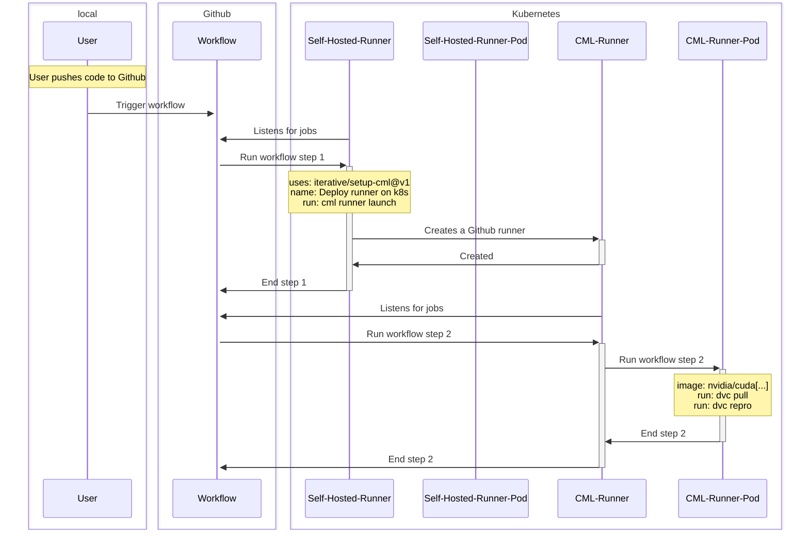

# CML Runner

In this chapter we want to delegate the gpu enabled runner instantiation to CML.

We want our infrastructure to work in the following way :



## Sources

[Cml self-hosted kubernetes runners documentation](https://cml.dev/doc/self-hosted-runners?tab=Kubernetes)

## Modifications needed to our CI

A new step is added to our CI workflow to deploy the runner on kubernetes.

```yaml
launch-runner:
  runs-on:
    group: default
    labels: [self-hosted]
  container:
    image: ubuntu:latest
  steps:
    - uses: actions/setup-node@v3
      with:
        node-version: '16'
    - uses: actions/checkout@v3
    - uses: iterative/setup-cml@v1
    - name: Deploy runner on self-hosted k8s
      env:
        REPO_TOKEN: ${{ secrets.CML_PAT_TOKEN }}
        KUBERNETES_CONFIGURATION: ${{ secrets.KUBERNETES_CONFIGURATION }}
      run: |
        cml runner launch \
            --cloud=kubernetes \
            --labels=cml-gpu
```

> The runner used to run this step must have access to the kubernetes cluster to create the runner pod. As such we use our own self-hosted runner to execute this step.

Note we added a kubeconfig secret to our repository secrets. To view your own kubeconfig file (if it is configured locally) you can run the following command:

```bash
cat ~/.kube/config
```
